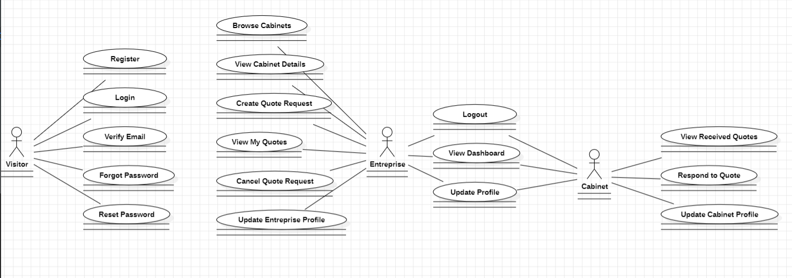
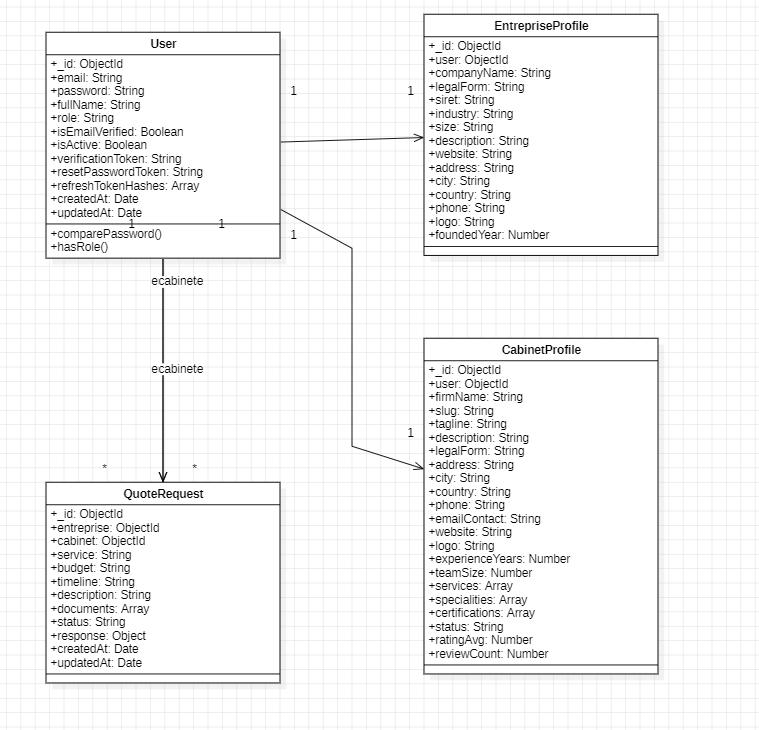
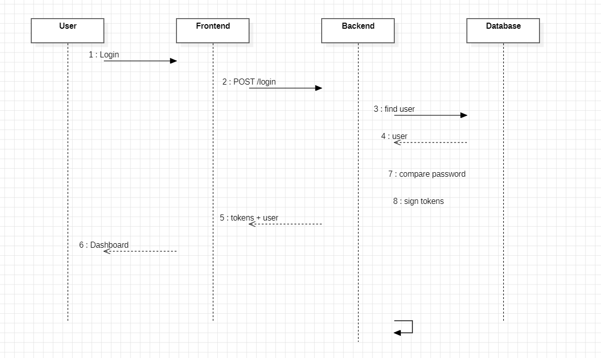

# diagram use-case : 
# diagram class : 
# diagram sequence / login:  


# ComptaLink Backend API

Backend API for the ComptaLink project, an application built to serve as a comprehensive link between accounting firms (cabinets) and enterprises. Built with Node.js, Express, and MongoDB.

## Features

- **Authentication & Authorization**: JWT-based authentication with role-based access control (Entreprise, Cabinet, Admin).
- **CRUD Operations**: Complete CRUD for Entreprises and Cabinets profiles.
- **Validation**: Data validation using Zod schemas.
- **Security**: Password hashing with bcrypt, helmet, and secure routing.

## Future Improvements

- Adding upload (to PDF) logic for generating and downloading quote PDFs.
- Adding appointment scheduling logic for managing meetings between entreprises and cabinets.
- Adding rate-limiting to protect API endpoints from abuse.

## Requirements

- Node.js (v18 or v20)
- MongoDB (local or Atlas)
- Docker & Docker Compose (optional for containerized deployment)

## Installation

1. Clone the repository and navigate into the project directory.
2. Install dependencies:
   ```bash
   npm install
   ```
3. Copy the environment configuration file:
   ```bash
   cp .env.example .env
   ```
4. Update `.env` with your specific configuration (e.g., `MONGO_URI`, `JWT_ACCESS_SECRET`).

## Configuration (.env)

- `NODE_ENV`: development or production
- `PORT`: Port to run the server on (default: 4000)
- `MONGO_URI`: MongoDB connection string
- `JWT_ACCESS_SECRET` / `JWT_REFRESH_SECRET`: Secrets for signing tokens
- `APP_URL`: Frontend application URL

## Utilisation

**Development Mode:**
```bash
npm run dev
```

**Production Mode:**
```bash
npm start
```

**Run Tests:**
```bash
npm test
```

## API Endpoints

### Auth
- `POST /api/auth/register` - Register a new user (entreprise or cabinet)
- `POST /api/auth/login` - Authenticate and get tokens
- `POST /api/auth/refresh` - Refresh access token
- `POST /api/auth/logout` - Logout user
- `GET /api/me` - Get current user profile
- `PATCH /api/me` - Update current user profile
- `GET /api/auth/verify-email` - Verify email address
- `POST /api/auth/resend-verification` - Resend verification email
- `POST /api/auth/forgot-password` - Request password reset
- `POST /api/auth/reset-password` - Reset password

### Entreprise
- `POST /api/entreprise` - Create entreprise profile
- `GET /api/entreprise/me` - Get current entreprise profile
- `PATCH /api/entreprise/me` - Update entreprise profile
- `DELETE /api/entreprise/me` - Delete entreprise profile

### Cabinet
- `GET /api/cabinets` - List approved cabinets
- `GET /api/cabinets/:id` - Get specific cabinet
- `GET /api/cabinet/me` - Get current cabinet profile
- `PATCH /api/cabinet/me` - Update cabinet profile

### Quotes
- `POST /api/quotes` - Create a quote request (entreprise only)
- `GET /api/quotes` - List user's quotes
- `GET /api/quotes/:id` - Get specific quote
- `POST /api/quotes/:id/respond` - Respond to a quote (cabinet only)
- `POST /api/quotes/:id/cancel` - Cancel a quote request (entreprise only)
